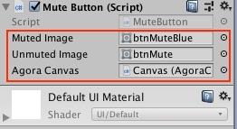

# Agora Tanks Demo for Unity3D

This tutorial enables you to quickly get started integrating voice chat into  Unity's [TANKS! Networking game application](https://assetstore.unity.com/packages/essentials/tutorial-projects/tanks-networking-demo-46213), using the Agora Gaming SDK. 

This sample app demonstrates the basic Agora SDK feature:

- [Join a Channel](#create-the-joinchannel-method)
- [Leave a Channel](#create-the-leavechannel-method)
- [Mute / Umute Audio](#mute-unmute-audio-method)

## Prerequisites
- Agora.io Developer Account
- Unity 3D 5.5+

## Steps to Integrate Agora Voice

The Agora integration for the Unity Tanks demo application, is comprised of one main class, `AgoraCanvas`, one mute button class, and one logging class `LoggerBridge`.

- [Set up the Tanks Demo Application](#set-up-the-tanks-demo-application)
- [Add Agora UI to the Scene](#add-agora-ui-to-the-scene)
- [Create the Folder Structure and Assets](#create-the-folder-structure-and-assets)
- [Create the AgoraCanvas Class](#create-the-agoracanvas-class)
- [Create the MuteButton Class](#create-the-mutebutton-class)
- [Create the LoggerBridge Class](#create-the-loggerbridge-class)
- [Link the Classes to the UI Objects](#link-the-classes-to-the-ui-objects)
- [Add App Settings, Agora SDK, and Run the App](#add-app-settings-agora-sdk-and-run-the-app)

### Set up the Tanks Demo Application

1. Add Unity's [TANKS! Networking Demo](https://assetstore.unity.com/packages/essentials/tutorial-projects/tanks-networking-demo-46213) to your Unity account.

	Ensure you are logged into unity, and Clicking on the **Add to My Assets** button.

	

	Read through the Terms of Service and click on the **Accept** button to add the project.

	

	Once the project has been added, a confirmation will appear at the top of the screen.
	
2. Download the Tanks project within the Unity desktop app.

	Click **Open in Unity** to launch Unity.

	

	Ensure the **Learn** tab is selected, and scroll down to the **Tanks** project. Click **Download** to start the download process. 
	
	**Note:** The **Download** button will change to a loader bar to show download progress.

	

3. Start the Tanks project in Unity.

	When the download is complete, the **Start** button will appear. Click on **Start** to load your project. 

	**Note:** It may take some time to import all the assets associated with this project.

	

### Add Agora UI to the Scene

The Tanks Demo application consists of one Unity scene called `_Complete-Game`.

Add a `Canvas` object to the stage.


The `Canvas` contains the following objects:

UI Variable|UI object|Description
---|---|---
`mShownMessage`|Text object|Welcome message for the user.
`mChannelNameInputField`|Text input box|Text input box for the user to enter the channel name.
`mBtnJoinChannel`|**Join Channel** UI button|Button to join the channel.
`mBtnLeaveChannel`|**Leave Channel** UI button|Button to leave the channel.
`MuteButton`|Mute UI button|Button to mute / unmute audio.

These objects will be linked to the `AgoraCanvas` class in the [Create the AgoraCanvas Class](#create-the-agoracanvas-class) section.

Add a `LoggerBridge` object to the stage.


This object will be linked to the `LoggerBridge` class in the [Create the AgoraCanvas Class](#create-the-loggerbridge-class) section.

### Create the Folder Structure and Assets

1. Create a folder called [`AgoraCanvas`](Assets/AgoraCanvas) in the [`Assets`](Assets) folder in the demo app. This folder will store the custom classes for integrating Agora Voice.

2. Create three empty `.cs` files and place them in the `AgoraCanvas` folder:

	- AgoraCanvas.cs
	- LoggerBridge.cs
	- MuteButton.cs

3. Create an `images` folder within the `AgoraCanvas` folder, that contain two image files:

	- btnMute.png
	- btnMuteBlue.png

	**Note:** You can use any two images to represent the active / inactive audio mute button.

The next two sections will cover the contents of the [`AgoraCanvas`](#create-the-agoracanvas-class), [`MuteButton`](#create-the-mutebutton-class), and [`LoggerBridge`](#create-the-loggerbridge-class) classes.

### Create the AgoraCanvas Class

The `AgoraCanvas` class is a subclass of `MonoBehaviour`. The [`AgoraCanvas.cs`](Assets/AgoraCanvas/AgoraCanvas.cs) file contains the relevant Agora SDK code for the Unity 3D sample application.

``` CSharp
using System;
using System.Collections;
using System.Collections.Generic;
using UnityEngine;
using UnityEngine.UI;

using agora_gaming_rtc;

public class AgoraCanvas : MonoBehaviour
{
	...
}
```

The remaining code in this section are contained within the `AgoraCanvas` class declaration.

- [Declare Global Variables](#declare-global-variables)
- [Create Initialization Methods](#create-initialization-methods)
- [Join / Leave Channel Methods](#join-leave-channel-methods)
- [Mute / Unmute Audio Method](#mute-unmute-audio-method)

#### Declare Global Variables

The `AgoraCanvas` class has five variables representing the UI objects.

Variable|Description
---|---
`mChannelNameInputField`|Text input field for the channel name.
`mShownMessage`|Welcome message for the user.
`versionText`|Display text for the application version number.
`joinChannel`|**Join Channel** button.
`leaveChannel`|**Leave Channel** button.
`muteButton`|Button with a picture of a microphone to mute/unmute audio.

``` CSharp
public InputField mChannelNameInputField;
public Text mShownMessage;
public Text versionText;
public Button joinChannel;
public Button leaveChannel;
public MuteButton muteButton;
```

Declare the `mRtcEngine` variable, which represents the Agora RTC engine for the application and App ID `appId`. The `appId` variable is initialized with the Agora App ID from your Agora Dashboard.

**Note:** `#YOUR APP ID#` must be replaced with a valid Agora App ID.

``` CSharp
private IRtcEngine mRtcEngine = null;

// PLEASE KEEP THIS App ID IN SAFE PLACE
// Get your own App ID at https://dashboard.agora.io/
// After you entered the App ID, remove ## outside of Your App ID
private string appId = #YOUR APP ID#;
```

#### Create Initialization Methods

- [Create the Awake() Method](#create-the-awake-method)
- [Create the Start() Method](#create-the-start-method)
- [Create the Update() Method](#create-the-update-method)

##### Create the Awake() Method

The `Awake()` method is invoked when the application awakens.

Set video sync count `QualitySettings.vSyncCount` to `0` and the target frame rate `Application.targetFrameRate` to `30`.

``` CSharp
void Awake ()
{
	QualitySettings.vSyncCount = 0;
	Application.targetFrameRate = 30;
}
```

##### Create the Start() Method

The `Start()` method initializes the application, Agora engine and UI event listeners.

``` CSharp
// Use this for initialization
void Start ()
{
	...
}
```

- [Add UI Event Listeners and Initialize Agora Engine](#add-ui-event-listeners-and-initialize-agora-engine)
- [Add Channel Join / Leave Event Listeners](#add-channel-join-leave-event-listeners)
- [Add User Event Listeners](#add-user-event-listeners)
- [Add Audio Change Event Listeners](#add-audio-change-event-listeners)
- [Add Warning and Error Event Listeners](#add-warning-and-error-event-listeners)
- [Add the Statistics Event Listener](#add-the-statistic-event-listeners)
- [Add Connection Event Listeners](#add-connection-event-listeners)
- [Configure the Agora RTC Engine](#configure-the-agora-rtc-engine)


###### Add UI Event Listeners and Initialize Agora Engine

Add click event listeners to the `joinChannel` and `leaveChannel` buttons using `onClick.AddListener`.

``` CSharp
joinChannel.onClick.AddListener (JoinChannel);	
leaveChannel.onClick.AddListener (LeaveChannel);
```

Initialize the Agora RTC engine `mRtcEngine` by passing `appId ` into `IRtcEngine.GetEngine()`.

Update the version display text by retrieving the SDK version using `IRtcEngine.GetSdkVersion()`.

``` CSharp
mRtcEngine = IRtcEngine.GetEngine (appId);
versionText.GetComponent<Text> ().text ="Version : " + IRtcEngine.GetSdkVersion ();
```

###### Add Channel Join / Leave Event Listeners

The `OnJoinChannelSuccess` event listener for `mRtcEngine` triggers when a user successfully joins a channel.

1. Create a string object `joinSuccessMessage` for the user's `uid`, `channel` name, and SDK `version` using `string.Format ()`.

2. Set a debug log using `Debug.Log ()` and the text for `mShownMessage.GetComponent<Text> ()` with `joinSuccessMessage`.

3. Display the mute button using `muteButton.SetHidden()`

``` CSharp
mRtcEngine.OnJoinChannelSuccess += (string channelName, uint uid, int elapsed) => {
	string joinSuccessMessage = string.Format ("joinChannel callback uid: {0}, channel: {1}, version: {2}", uid, channelName, IRtcEngine.GetSdkVersion ());
	Debug.Log (joinSuccessMessage);
	mShownMessage.GetComponent<Text> ().text = (joinSuccessMessage);
};
	muteButton.SetHidden (false);
```

The `OnLeaveChannel` event listener for `mRtcEngine` triggers when a user successfully leaves a channel.

1. Create a string object `leaveChannelMessage` for the session `duration`, `tx` location, `rx` location, `tx` bitrate, and `rx` bitrate using `string.Format ()`.

2. Set a debug log using `Debug.Log ()` and the text for `mShownMessage.GetComponent<Text> ()` with `leaveChannelMessage`.

3. Hide the mute button using `muteButton.SetHidden()`

``` CSharp
mRtcEngine.OnLeaveChannel += (RtcStats stats) => {
	string leaveChannelMessage = string.Format ("onLeaveChannel callback duration {0}, tx: {1}, rx: {2}, tx kbps: {3}, rx kbps: {4}", stats.duration, stats.txBytes, stats.rxBytes, stats.txKBitRate, stats.rxKBitRate);
	Debug.Log (leaveChannelMessage);
	mShownMessage.GetComponent<Text> ().text = (leaveChannelMessage);
	muteButton.SetHidden (true);
};
```

###### Add User Event Listeners

The `onUserJoined` event listener for `mRtcEngine` triggers when a user joins the channel.

Set a debug log for the user's `uid` and `elapsed` time using `Debug.Log ()`.

``` CSharp
mRtcEngine.OnUserJoined += (uint uid, int elapsed) => {
	string userJoinedMessage = string.Format ("onUserJoined callback uid {0} {1}", uid, elapsed);
	Debug.Log (userJoinedMessage);
};
```

The `OnUserOffline` event listener for `mRtcEngine` triggers when a user goes offline.

Set a debug log for the user's `uid` and `reason` using `Debug.Log ()`.

``` CSharp
mRtcEngine.OnUserOffline += (uint uid, USER_OFFLINE_REASON reason) => {
	string userOfflineMessage = string.Format ("onUserOffline callback uid {0} {1}", uid, reason);
	Debug.Log (userOfflineMessage);
};
```

The `OnUserMuted` event listener for `mRtcEngine` triggers when a user mutes their audio.

Set a debug log for the user's `uid` and `muted` status using `Debug.Log ()`.

``` CSharp
mRtcEngine.OnUserMuted += (uint uid, bool muted) => {
	string userMutedMessage = string.Format ("onUserMuted callback uid {0} {1}", uid, muted);
	Debug.Log (userMutedMessage);
};
```

###### Add Audio Change Event Listeners

The `OnVolumeIndication` event listener for `mRtcEngine` triggers when the audio device indicators change.

If the number of speakers is `0` or invalid, set a debug log for the total volume using `Debug.Log ()`.

Iterate through the speakers and set a debug log for the `speakerNumber`, the speaker's `uid`, and `volume` of the speaker using `Debug.Log ()`.

``` CSharp
mRtcEngine.OnVolumeIndication += (AudioVolumeInfo[] speakers, int speakerNumber, int totalVolume) => {
	if (speakerNumber == 0 || speakers == null) {
		Debug.Log (string.Format("onVolumeIndication only local {0}", totalVolume));
	}

	for (int idx = 0; idx < speakerNumber; idx++) {
		string volumeIndicationMessage = string.Format ("{0} onVolumeIndication {1} {2}", speakerNumber, 	speakers[idx].uid, speakers[idx].volume);
		Debug.Log (volumeIndicationMessage);
	}
};
```

The `OnAudioRouteChanged` event listener for `mRtcEngine` triggers when the audio route changes.

Set a debug log for the `route` using `Debug.Log ()`.


``` CSharp
mRtcEngine.OnAudioRouteChanged += (AUDIO_ROUTE route) => {
	string routeMessage = string.Format ("onAudioRouteChanged {0}", route);
	Debug.Log (routeMessage);
};
```

###### Add Warning and Error Event Listeners

The `OnWarning` event listener for `mRtcEngine` triggers when a warning occurs in the Agora RTC engine.

Set a debug log for the `warn` object, warning `msg`, and warning `description` using `Debug.Log ()`.

``` CSharp
mRtcEngine.OnWarning += (int warn, string msg) => {
	string description = IRtcEngine.GetErrorDescription(warn);
	string warningMessage = string.Format ("onWarning callback {0} {1} {2}", warn, msg, description);
	Debug.Log (warningMessage);
};
```

The `OnError` event listener for `mRtcEngine` triggers when an error occurs in the Agora RTC engine.

Set a debug log for the `error` object, error `msg`, and error `description` using `Debug.Log ()`.

``` CSharp
mRtcEngine.OnError += (int error, string msg) => {
	string description = IRtcEngine.GetErrorDescription(error);
	string errorMessage = string.Format ("onError callback {0} {1} {2}", error, msg, description);
	Debug.Log (errorMessage);
};
```

###### Add Statistics Event Listeners

The `OnRtcStats` event listener for `mRtcEngine` triggers when the statistics change on the Agora RTC engine.

1. Set a debug log for the following stastics: `duration`,`txBytes`,`rxBytes`,`txKBitRate`,`rxKBitRate`,`txAudioKBitRate`,`rxAudioKBitRate`,`users` using `Debug.Log ()`.

2. Retrieve the length of the mixing file and mixing duration using `mRtcEngine.GetAudioMixingDuration()` and `mRtcEngine.GetAudioMixingCurrentPosition()`.

3. Set a debug log of `lengthOfMixingFile` and `currentTs` using `Debug.Log ()`.

``` CSharp
mRtcEngine.OnRtcStats += (RtcStats stats) => {
	string rtcStatsMessage = string.Format ("onRtcStats callback duration {0}, tx: {1}, rx: {2}, tx kbps: {3}, rx kbps: {4}, tx(a) kbps: {5}, rx(a) kbps: {6} users {7}",
	stats.duration, stats.txBytes, stats.rxBytes, stats.txKBitRate, stats.rxKBitRate, stats.txAudioKBitRate, stats.rxAudioKBitRate, stats.users);
	Debug.Log (rtcStatsMessage);

	int lengthOfMixingFile = mRtcEngine.GetAudioMixingDuration();
	int currentTs = mRtcEngine.GetAudioMixingCurrentPosition();

	string mixingMessage = string.Format ("Mixing File Meta {0}, {1}", lengthOfMixingFile, currentTs);
	Debug.Log (mixingMessage);
};
```

###### Add Connection Event Listeners

The `OnRequestToken` event listener for `mRtcEngine` triggers when the request token changes.

Set a debug log for the request key message `requestKeyMessage` using `Debug.Log ()`.

``` CSharp
mRtcEngine.OnRequestToken += () => {
	string requestKeyMessage = string.Format ("OnRequestToken");
	Debug.Log (requestKeyMessage);
};
```

The `OnConnectionInterrupted` event listener for `mRtcEngine` triggers when the connection is interrupted.

Set a debug log for the interruption message `interruptedMessage` using `Debug.Log ()`.

``` CSharp
mRtcEngine.OnConnectionInterrupted += () => {
	string interruptedMessage = string.Format ("OnConnectionInterrupted");
	Debug.Log (interruptedMessage);
};
```

The `OnConnectionLost` event listener for `mRtcEngine` triggers when the connection is lost.

Set a debug log for the connection lost message `lostMessage` using `Debug.Log ()`.

``` CSharp
mRtcEngine.OnConnectionLost += () => {
	string lostMessage = string.Format ("OnConnectionLost");
	Debug.Log (lostMessage);
};
```

###### Initialize the Agora RTC Engine

- Set the log filter for the engine using `mRtcEngine.SetLogFilter ()`.
- Set the channel profile to `CHANNEL_PROFILE.GAME_FREE_MODE` using `mRtcEngine.SetChannelProfile ()`.
- Set the client role broadcaster by passing `CLIENT_ROLE.BROADCASTER` into `mRtcEngine.SetClientRole ()`.

``` CSharp
mRtcEngine.SetLogFilter (LOG_FILTER.INFO);

mRtcEngine.SetChannelProfile (CHANNEL_PROFILE.GAME_FREE_MODE);
```


##### Create the Update() Method

The `Update()` method is invoked when the application updates.

If `mRtcEngine` is valid, invoke `mRtcEngine.Poll ()`.

``` CSharp
// Update is called once per frame
void Update ()
{
	if (mRtcEngine != null) {
		mRtcEngine.Poll ();
	}
}
```

#### Join / Leave Channel Methods

The `AgoraCanvas` class has two methods to manage joining and leaving a channel.

##### Create the JoinChannel() Method

The `JoinChannel ()` method joins the user to the channel specified by the text input box `mChannelNameInputField`.

1. Set a debug log for `channelName` using `Debug.Log()`, and ensure `channelName` is not null or empty, before executing the remaining code for the method.

2. Join the channel using `mRtcEngine.JoinChannel ()`.


``` CSharp
public void JoinChannel ()
{
	string channelName = mChannelNameInputField.text.Trim ();

	Debug.Log (string.Format ("tap joinChannel with channel name {0}", channelName));

	if (string.IsNullOrEmpty (channelName)) {
		return;
	}

	mRtcEngine.JoinChannel (channelName, "extra", 0);
}
```

##### Create the LeaveChannel() Method

The `LeaveChannel ()` method exits the user from the current channel.

Leave the channel using `mRtcEngine.LeaveChannel()`.

``` CSharp
public void LeaveChannel ()
{
	mRtcEngine.LeaveChannel ();
}
```


#### Mute / Unmute Audio Method

The `MuteSelf()` method mutes/unmutes the local audio stream using `mRtcEngine.MuteLocalAudioStream()`.

```
	public void MuteSelf (bool shouldMute) {
		mRtcEngine.MuteLocalAudioStream (shouldMute);
	}
```

### Create the MuteButton Class

The `MuteButton` class defines the mute button for the game scene.

The class defines 5 variables:

- `mutedImage` for the muted state icon.
- `unmutedImage` for the unmuted state icon.
- `agoraCanvas` to communicate to/from the `AgoraCanvas` class .
- `myImageComponent` to reference the button image.
- `isMuted` to indicate if the audio is muted / unmuted.

When the class starts, set `gameObject` to inactive using `gameObject.SetActive()`.

```
using System.Collections;
using System.Collections.Generic;
using UnityEngine;
using UnityEngine.UI;

public class MuteButton : MonoBehaviour {

	public Sprite mutedImage;
	public Sprite unmutedImage;
	public AgoraCanvas agoraCanvas;

	Image myImageComponent;
	private bool isMuted = false;

	void Start () {
		myImageComponent = GetComponent<Image> ();
		gameObject.SetActive (false);
	}
```

The `SetHidden()` method shows / hides the mute button and updates the game object.

If `hidden` is `false`, set `isMuted` to `false` and change the image for `myImageComponent` to `unmutedImage`.

Set the game object to active / inactive using `gameObject.SetActive()`.

```
	public void SetHidden (bool hidden) {
		if (!hidden) {
			isMuted = false;
			myImageComponent.sprite = unmutedImage;
		}

		gameObject.SetActive (!hidden);
	}
```

The mute button invokes the `MuteClicked()` method:

1. Update `isMuted`.
2. Update the image for `myImageComponent` based on `isMuted`.
3. Mute / unmute the user using `agoraCanvas.MuteSelf()`.

```
	public void MuteClicked () {
		isMuted = !isMuted;
		myImageComponent.sprite = isMuted ? mutedImage : unmutedImage;

		agoraCanvas.MuteSelf (isMuted);
	}
}
```

### Create the LoggerBridge Class

The `LoggerBridge` class is a subclass of `MonoBehaviour`. The [`LoggerBridge.cs`](Assets/AgoraCanvas/LoggerBridge.cs) file contains the relevant logging code for the app.

The `Start()` and `Update()` methods are empty placeholder methods inherited from `MonoBehaviour`. Optional logs can be added if desired.

The `doLog()` method is a used for logging messages specified by `msg` using `Debug.Log()`.

``` CSharp
using System.Collections;
using UnityEngine;

public class LoggerBridge : MonoBehaviour {

	// Use this for initialization
	void Start () {
		
	}
	
	// Update is called once per frame
	void Update () {
		
	}

	public void doLog(string msg) {
		Debug.Log (msg);
	}
}
```

### Link the Classes to the UI Objects

Map the UI objects from the Unity UI to their respective classes.

- [Link the AgoraCanvas Class](#link-the-agoracanvas-class)
- [Link the MuteButton Class](#link-the-mutebutton-class)
- [Link the LoggerBridge Class](#link-the-loggerbridge-class)


#### Link the AgoraCanvas Class

In Unity, select the `Canvas` object created in the [Add Agora UI to the Scene](#add-agora-ui-to-the-scene) section.

1. Link `Canvas` to the `AgoraCanvas` class created in the [Create the AgoraCanvas Class](#create-the-agoracanvas-class) section.

	

2. Link the following variables from the `AgoraCanvas` class:

	

Script Panel Name|Class variable|Description
---|---|---
**M Channel Name Input Field**|`mChannelNameInputField`|Link the channel text input component from the stage.
**M Shown Message**|`mShownMessage`|Link the welcome text from the stage.
**Version Text**|`versionText`|No link required. Version text can be  optionally added.
**Join Channel**|`joinChannel`|Link the **Join Channel** button from the stage.
**Leave Channel**|`leaveChannel`|Link the **Leave Channel** button from the stage.
**Mute Button**|`muteButton`|Link the mute button component from the stage.


#### Link the MuteButton Class

Select the `MuteButton` object created in the [Add Agora UI to the Scene](#add-agora-ui-to-the-scene) section.

1. Ensure the images for the mute button are set to Sprite objects by selecting **Sprite (2D and UI)** in the **Texture Type** dropdown menu.

	

2. Link the white muted image as the **Target Graphic**, to represent mute is inactive on first load.
	
	

3. Add the `MuteClicked` method into the **On Click()** panel.
	
	
	
4. Link `MuteButton` to the `MuteButton` class created in the [Create the MuteButton Class](#create-the-mutebutton-class) section.

	

5. Link the following variables from the `MuteButton` class:

	

Script Panel Name|Class variable|Description
---|---|---
**Muted Image**|`mutedImage`|Link a blue muted image, to represent mute is active.
**Unmuted Image**|`unmutedImage`|Link a white muted image, to represent mute is inactive.
**Agora Canvas**|`agoraCanvas`|Link the `Canvas` object created in the [Add Agora UI to the Scene](#add-agora-ui-to-the-scene) section.

#### Link the LoggerBridge Class

Select the `LoggerBridge` object created in the [Add Agora UI to the Scene](#add-agora-ui-to-the-scene) section. Link `LoggerBridge` to the `LoggerBridge` class created in the [Create the LoggerBridge Class](#create-the-loggerbridge-class) section.


### Add App Settings, Agora SDK, and Run the App

This section shows you how to prepare and build the app.

#### Create an Account and Obtain an App ID

In order to build and run the sample application you must obtain an App ID: 

1. Create a developer account at [agora.io](https://dashboard.agora.io/signin/). Once you finish the signup process, you will be redirected to the Dashboard.
2. Navigate in the Dashboard tree on the left to **Projects** > **Project List**.
3. Copy the App ID that you obtained from the Dashboard into a text file. You will use this when you launch the app.

#### Update and Run the Application 

1. Edit the [`Assets/AgoraCanvas/AgoraCanvas.cs`](Assets/AgoraCanvas/AgoraCanvas.cs) file. In the `AgoraCanvas` class declaration, update `#YOUR APP ID#` with your App ID.

	`private string appId = #YOUR APP ID#;`

2. Download the [Agora Gaming SDK](https://www.agora.io/en/download/) for Unity 3D.

	

3. Unzip the downloaded SDK package and copy the files from the following SDK folders into the associated sample application folders.

SDK Folder|Application Folder
---|---
`libs/Android/`|`Assets/Plugins/Android/AgoraAudioKit.plugin/libs/`
`libs/iOS/`|`Assets/Plugins/iOS/`
`libs/Scripts/AgoraGamingSDK/`|`Assets/Scripts/AgoraGamingSDK/`

4. Open the project in Unity and run the sample application.

## Learn More

- A more complete demo of Agora Voice for Unity, can be found in the [Spacewar with AMG Voice SDK for Unity](https://github.com/AgoraIO/Spacewar-with-AMG-Voice-SDK-Unity) project.
- Agora Video SDK samples are also available for the following platforms:
	- Hello Gaming Agora for [iOS](https://github.com/AgoraIO/Hello-Gaming-Agora-iOS)
	- Hello Gaming Agora for [Android](https://github.com/AgoraIO/Hello-Gaming-Agora-Android)
	- Hello Gaming Agora for [Cocos2d](https://github.com/AgoraIO/Hello-Cocos2d-Agora)

## Resources

- Complete API documentation is available at the [Document Center](https://docs.agora.io/en/).
- You can file bugs about this sample [here](https://github.com/AgoraIO/Hello-Unity3D-Agora/issues).

## License

This software is under the MIT License (MIT). [View the license](LICENSE.md).
